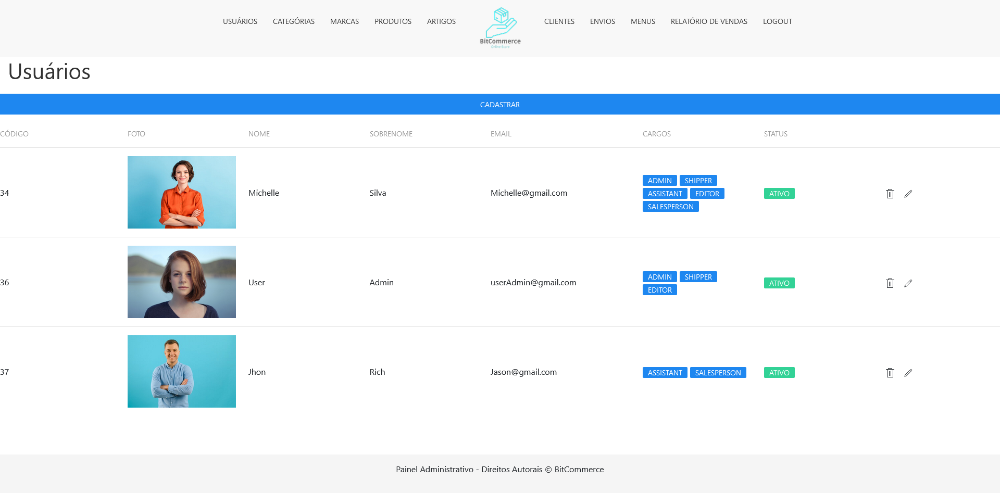

# Projeto E-commerce 

## Descrição do Projeto

Este projeto é um E-commerce desenvolvido com o objetivo de criar uma plataforma de comércio eletrônico onde usuários podem navegar por produtos, adicioná-los ao carrinho e realizar compras online.

## Tecnologias Utilizadas

- Spring Framework: Utilizado para criar uma aplicação web robusta, segura e escalável.
- MySQL: Banco de dados relacional utilizado para armazenar os dados dos produtos, usuários e outras informações relevantes.
- Thymeleaf: Um mecanismo de template utilizado para renderizar as páginas HTML com dados dinâmicos do backend.
- UIkit: Framework frontend utilizado para criar um design moderno, responsivo e amigável para o usuário.

## Arquitetura do Projeto

O projeto utiliza uma arquitetura de Testes Multi-Project Maven, que é organizada da seguinte forma:

- **shopme-common**: Módulo que contém a lógica de negócio e os modelos de dados.
- **shopme-webParent**: Módulo que é responsável pela parte web do projeto, contendo os controladores, views (HTML/Thymeleaf), e recursos estáticos.
- **shopme-test**: Módulo que contém os testes unitários e de integração para garantir a qualidade do código.
- **shopme-Ecommerce**: Módulo que contém as funções necessárias para o usuário no caso para quem vai realizar a compra no ecommerce.
- **shopme-Admin**: Módulo que contém as funções necessárias para administrar as vendas realizadas do ecommerce, entre outras funções relacionadas a gestão de vendas modulo de gestão

A arquitetura segue um padrão MVC (Model-View-Controller), onde a lógica de negócio está no pacote "controller", as entidades do banco de dados estão no pacote "model" e as views estão no pacote "view".
No caso templates.

## Como Funciona o Projeto

1. **Cadastro de Usuário**: O usuário pode se cadastrar no sistema fornecendo informações como nome, email e senha.

2. **Navegação de Produtos**: O usuário pode navegar pelos produtos disponíveis no sistema, filtrá-los por categoria, preço, etc.

3. **Detalhes do Produto**: Ao clicar em um produto, o usuário pode ver mais detalhes sobre ele, incluindo imagens, descrição e preço.

4. **Adicionar ao Carrinho**: O usuário pode adicionar produtos ao carrinho de compras para posteriormente efetuar a compra.

5. **Finalizar Compra**: Após adicionar produtos ao carrinho, o usuário pode finalizar a compra fornecendo informações de pagamento e endereço de entrega.

6. **Gerenciamento de Pedidos**: Os usuários podem visualizar seus pedidos anteriores e verificar o status da entrega.

## Capturas de Tela

1. Página Inicial:
   

2. Detalhes do Produto:
   

3. Carrinho de Compras:
   

## Executando o Projeto

## Executando o Projeto

Para executar o projeto localmente, siga os passos abaixo:

1. Clone o repositório para a sua máquina local:

git clone https://github.com/seu-usuario/ecommerce.git

javascript

2. Configure o banco de dados MySQL e atualize as informações de conexão no arquivo `application.properties`.

3. Abra o terminal e navegue para a pasta do projeto:

cd ecommerce

4. Compile e empacote o projeto com Maven:

mvn clean install

5. Execute o projeto:

mvn spring-boot:run

6. Abra o navegador e acesse a URL: `http://localhost:8081`.

1. Clone o repositório para a sua máquina local:
2. Configure o banco de dados MySQL e atualize as informações de conexão no arquivo `application.properties`.
3. Abra o terminal e navegue para a pasta do projeto:
